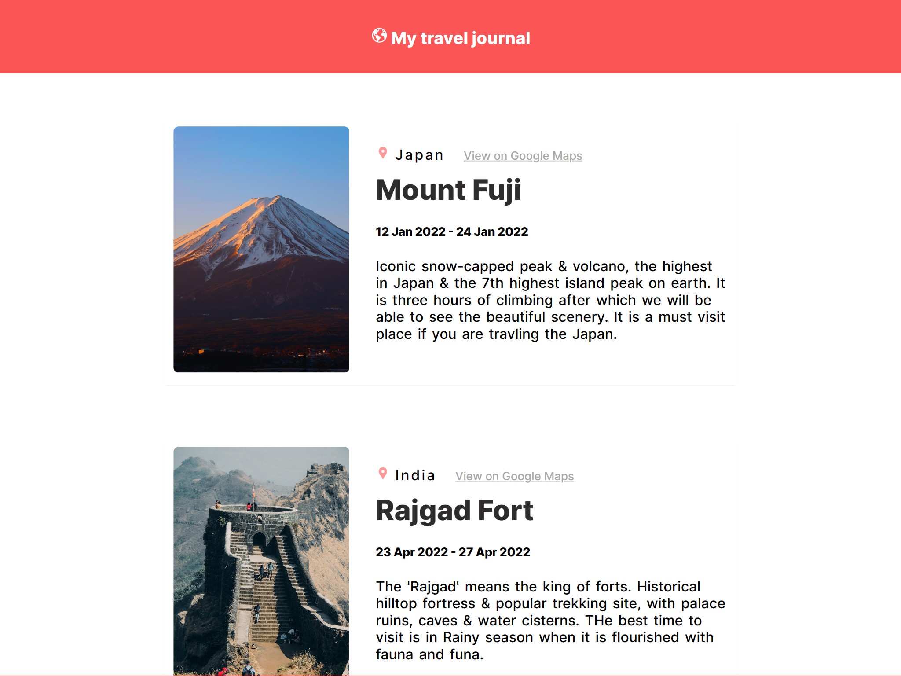

# Travel Guide using React

## Creating the project

You can clone project and build the project using ```npm install``` which will add pull all the required dependencies.

Then you can run the project usin
g the ```npm start``` which will load the project.



## The Project

In this project we are replicating a API call with a js object which we are exporting from a file and then displaying that content dynamically using the React.

The number of card (The places traveled) can be added or removed using the "Data.js" file. This file contains the object that we use to replicate the API call. So adding the object with similar fields will result in addition of a place in the journal.
